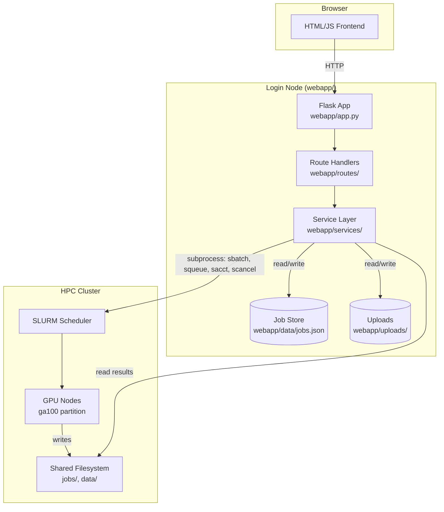
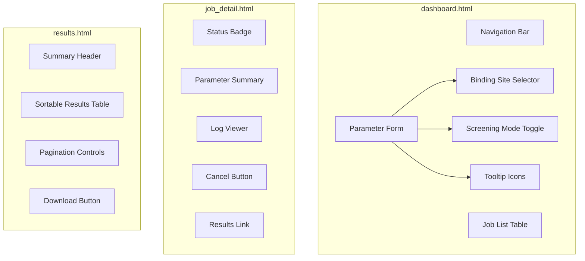

# Design Document: DrugCLIP Web Application

## Overview

The DrugCLIP Web Application is a Flask-based web interface that wraps the existing DrugCLIP virtual screening pipeline, allowing researchers to submit, monitor, and retrieve screening jobs on an HPC cluster via SLURM — all from a browser. The app lives entirely in the `webapp/` directory and delegates heavy computation to the existing shell scripts (`submit_screening.sh`, `submit_large_screening.sh`) and Python utilities already in the repository.

The core design goals are:

1. **Zero CLI knowledge required** — researchers interact only with web forms and tables.
2. **Multi-tenancy** — many concurrent users, each isolated by server-side sessions.
3. **Thin wrapper** — the webapp constructs and executes the same shell commands a user would type, capturing SLURM job IDs and polling for status. No reimplementation of the pipeline.
4. **Sensible defaults with expert overrides** — every parameter is pre-filled and accompanied by a plain-language tooltip.

The application runs on a login node (or a lightweight VM with SLURM client access) and communicates with the scheduler via `subprocess` calls to `sbatch`, `squeue`, `sacct`, and `scancel`.

## Architecture



### Key Architectural Decisions

**Decision 1: Server-side rendering with Jinja2 templates + minimal JS.**
Rationale: The app is form-heavy with simple interactivity (show/hide fields, tooltips, polling). A full SPA framework (React, Vue) would add build tooling complexity with little benefit. Jinja2 templates with vanilla JS and a CSS framework (Bootstrap 5) keep the stack simple and the `webapp/` directory self-contained.

**Decision 2: JSON file-based job store instead of a database.**
Rationale: The job store holds lightweight metadata (job IDs, parameters, timestamps, status). The actual data (uploads, results) lives on the shared filesystem. A JSON file with file-locking is sufficient for the expected concurrency (tens of users, not thousands) and avoids adding a database dependency. If scale demands grow, this can be swapped for SQLite with minimal changes.

**Decision 3: Subprocess-based SLURM integration.**
Rationale: The webapp runs on a node with SLURM client tools installed. Calling `sbatch`, `squeue`, `sacct`, and `scancel` via `subprocess.run()` is the simplest and most reliable integration path. It reuses the exact same shell scripts researchers would run manually, ensuring behavioral parity.

**Decision 4: Background thread for job status polling.**
Rationale: A background thread (using `threading.Thread` with a daemon flag) polls SLURM at a configurable interval (default 30s) and updates the job store. This avoids the need for Celery or an external task queue while keeping the UI responsive.

## Components and Interfaces

### Directory Structure

```
webapp/
├── app.py                    # Flask app factory and entry point
├── config.py                 # Configuration (upload limits, poll interval, paths)
├── routes/
│   ├── __init__.py
│   ├── dashboard.py          # GET /  — dashboard with form + job list
│   ├── jobs.py               # POST /jobs/submit, GET /jobs/<id>, POST /jobs/<id>/cancel
│   ├── results.py            # GET /jobs/<id>/results, GET /jobs/<id>/results/download
│   ├── logs.py               # GET /jobs/<id>/log
│   └── help.py               # GET /help
├── services/
│   ├── __init__.py
│   ├── file_upload.py        # File validation, storage, path management
│   ├── job_submission.py     # Command construction, sbatch execution, job recording
│   ├── job_monitor.py        # Background SLURM polling, status updates
│   ├── slurm_client.py       # Low-level subprocess wrappers for SLURM commands
│   └── job_store.py          # JSON-based job metadata persistence with file locking
├── templates/
│   ├── base.html             # Base layout with nav bar, Bootstrap 5, tooltip JS
│   ├── dashboard.html        # Job submission form + job list table
│   ├── job_detail.html       # Single job: params, status, log viewer, results link
│   ├── results.html          # Paginated results table with sort + download
│   ├── help.html             # Workflow overview, binding site guide, mode guide
│   └── error.html            # User-friendly error page with reference ID
├── static/
│   ├── css/
│   │   └── style.css         # Custom styles (tooltip styling, log viewer, etc.)
│   └── js/
│       └── form.js           # Show/hide binding site fields, auto-fill target name
└── data/
    └── jobs.json             # Persistent job metadata store
```

### Component Interfaces

#### 1. `webapp/services/slurm_client.py` — SLURM Client

Low-level wrapper around SLURM CLI commands. All subprocess calls are centralized here.

```python
class SlurmClient:
    def sbatch(self, script_path: str, script_args: list[str]) -> str:
        """Submit a job via sbatch. Returns the SLURM job ID string.
        Raises SlurmError on failure."""

    def sbatch_inline(self, command: str, slurm_args: dict) -> str:
        """Submit a job via sbatch --wrap. Returns the SLURM job ID string."""

    def squeue(self, job_ids: list[str] | None = None, user: str | None = None) -> list[dict]:
        """Query job status. Returns list of {job_id, state, name, time, ...}."""

    def sacct(self, job_ids: list[str]) -> list[dict]:
        """Query completed job info. Returns list of {job_id, state, exit_code, ...}."""

    def scancel(self, job_id: str) -> None:
        """Cancel a job. Raises SlurmError on failure."""

    def is_available(self) -> bool:
        """Check if SLURM commands are accessible. Returns True/False."""
```

#### 2. `webapp/services/file_upload.py` — File Upload Handler

```python
class FileUploadHandler:
    ALLOWED_PDB = {'.pdb'}
    ALLOWED_LIBRARY = {'.sdf', '.smi', '.smiles', '.txt'}
    ALLOWED_LIGAND = {'.pdb', '.sdf'}
    MAX_FILE_SIZE = 500 * 1024 * 1024  # 500 MB

    def validate_and_save(self, file, session_id: str, file_type: str) -> str:
        """Validate extension and size, save to uploads/<session_id>/.
        Returns the saved file path. Raises ValidationError on failure."""

    def get_upload_dir(self, session_id: str) -> str:
        """Return the upload directory for a session, creating it if needed."""

    def cleanup_session(self, session_id: str) -> None:
        """Remove all uploaded files for a session."""
```

#### 3. `webapp/services/job_submission.py` — Job Submission Service

```python
class JobSubmissionService:
    def __init__(self, slurm_client: SlurmClient, job_store: JobStore,
                 project_root: str):
        ...

    def submit_standard(self, params: JobParams) -> JobRecord:
        """Build and execute `sbatch submit_screening.sh ...`.
        Returns a JobRecord with the SLURM job ID."""

    def submit_large_scale(self, params: JobParams) -> JobRecord:
        """Build and execute `bash submit_large_screening.sh ...`.
        Returns a JobRecord with the SLURM job ID(s)."""

    def build_command_args(self, params: JobParams) -> list[str]:
        """Convert JobParams into CLI arguments for the shell scripts."""

    def cancel_job(self, job_id: str, session_id: str) -> None:
        """Cancel a SLURM job. Raises AuthorizationError if session doesn't own the job."""
```

#### 4. `webapp/services/job_monitor.py` — Job Monitor

```python
class JobMonitor:
    def __init__(self, slurm_client: SlurmClient, job_store: JobStore,
                 poll_interval: int = 30):
        ...

    def start(self) -> None:
        """Start the background polling thread."""

    def stop(self) -> None:
        """Stop the background polling thread."""

    def poll_once(self) -> None:
        """Poll SLURM for all active jobs and update the job store."""

    def get_job_status(self, job_id: str) -> str:
        """Get the current status of a specific job from the store."""
```

#### 5. `webapp/services/job_store.py` — Job Store

```python
class JobStore:
    def __init__(self, store_path: str):
        ...

    def add_job(self, record: JobRecord) -> None:
        """Add a new job record. Thread-safe with file locking."""

    def update_job(self, job_id: str, updates: dict) -> None:
        """Update fields on an existing job record."""

    def get_job(self, job_id: str) -> JobRecord | None:
        """Retrieve a single job record by SLURM job ID."""

    def get_jobs_for_session(self, session_id: str) -> list[JobRecord]:
        """Retrieve all jobs belonging to a session, newest first."""

    def get_active_jobs(self) -> list[JobRecord]:
        """Retrieve all jobs in PENDING or RUNNING state across all sessions."""
```

#### 6. Route Handlers

| Route | Method | Handler | Description |
|-------|--------|---------|-------------|
| `/` | GET | `dashboard.index` | Dashboard with submission form + job list |
| `/jobs/submit` | POST | `jobs.submit` | Validate form, upload files, submit SLURM job |
| `/jobs/<id>` | GET | `jobs.detail` | Job detail page (params, status, log link) |
| `/jobs/<id>/cancel` | POST | `jobs.cancel` | Cancel a PENDING/RUNNING job |
| `/jobs/<id>/results` | GET | `results.view` | Paginated results table |
| `/jobs/<id>/results/download` | GET | `results.download` | Download results.txt as CSV |
| `/jobs/<id>/log` | GET | `logs.view` | SLURM log contents (JSON for AJAX refresh) |
| `/help` | GET | `help.index` | Help/documentation page |

### Frontend Components



**Binding Site Selector behavior:**
- Radio buttons for the four methods
- JavaScript shows/hides the relevant input fields based on selection
- Only one method's fields are visible at a time

**Screening Mode Toggle behavior:**
- Radio buttons: Standard (default) / Large-Scale
- When Large-Scale is selected, JS reveals chunk size, partition, and max parallel fields
- When Standard is selected, those fields are hidden

**Tooltip System:**
- Each parameter label has an `<i>` icon (Bootstrap Icons info-circle)
- Tooltips use Bootstrap 5's built-in tooltip component (`data-bs-toggle="tooltip"`)
- Tooltip text is defined in the template as `data-bs-title` attributes

## Data Models

### JobParams (form submission → service layer)

```python
@dataclass
class JobParams:
    """Parameters collected from the submission form."""
    session_id: str
    pdb_path: str                          # Absolute path to uploaded PDB
    library_path: str                      # Absolute path to uploaded library
    binding_site_method: str               # 'ligand' | 'residue' | 'center' | 'binding_residues'
    ligand_path: str | None                # Path to ligand file (if method='ligand')
    residue_name: str | None               # HETATM residue name (if method='residue')
    center_x: float | None                # X coordinate (if method='center')
    center_y: float | None                # Y coordinate
    center_z: float | None                # Z coordinate
    binding_residues: str | None           # Space-separated residue numbers (if method='binding_residues')
    chain_id: str | None                   # Optional chain ID for binding_residues
    cutoff: float = 10.0                   # Pocket extraction radius in Å
    target_name: str | None = None         # Defaults to PDB filename stem
    top_fraction: float = 0.02             # Fraction of library to return
    screening_mode: str = 'standard'       # 'standard' | 'large_scale'
    chunk_size: int = 1_000_000            # Large-scale only
    partition: str = 'ga100'               # Large-scale only
    max_parallel: int = 50                 # Large-scale only
```

### JobRecord (persistent job metadata)

```python
@dataclass
class JobRecord:
    """Persistent metadata for a submitted job."""
    job_id: str                            # Primary SLURM job ID
    session_id: str                        # Owning session
    target_name: str                       # e.g., "6QTP"
    library_name: str                      # e.g., "enamine_dds10"
    screening_mode: str                    # 'standard' | 'large_scale'
    status: str                            # PENDING | RUNNING | COMPLETED | FAILED | CANCELLED | TIMEOUT
    submitted_at: str                      # ISO 8601 timestamp
    updated_at: str                        # ISO 8601 timestamp
    params: dict                           # Full JobParams as dict for display
    job_dir: str                           # e.g., "jobs/6QTP_vs_enamine_dds10"
    log_path: str | None                   # Path to SLURM log file
    results_path: str | None               # Path to results.txt (set on COMPLETED)
    error_message: str | None              # Set on FAILED/TIMEOUT
    child_job_ids: list[str] | None        # Large-scale: array job IDs for stages 3-5
```

### JSON Job Store Format

The `webapp/data/jobs.json` file stores a list of `JobRecord` objects serialized as JSON:

```json
{
  "jobs": [
    {
      "job_id": "12345",
      "session_id": "abc123def456",
      "target_name": "6QTP",
      "library_name": "enamine_dds10",
      "screening_mode": "standard",
      "status": "COMPLETED",
      "submitted_at": "2025-01-15T10:30:00Z",
      "updated_at": "2025-01-15T11:45:00Z",
      "params": { "...": "..." },
      "job_dir": "jobs/6QTP_vs_enamine_dds10",
      "log_path": "jobs/logs/slurm_12345.log",
      "results_path": "jobs/6QTP_vs_enamine_dds10/results.txt",
      "error_message": null,
      "child_job_ids": null
    }
  ]
}
```

### Results File Format

Results are produced by the existing pipeline at `jobs/<target>_vs_<library>/results.txt`. Each line is:

```
SMILES,score
```

Sorted by descending score. The Results Viewer parses this file and presents it as a paginated, sortable table.

### Session Model

Sessions use Flask's built-in server-side session support (via `flask-session` with filesystem backend):

- Session ID: UUID4, stored in a signed cookie
- Session data directory: `webapp/flask_session/`
- Upload directory per session: `webapp/uploads/<session_id>/`
- Jobs are associated with sessions via `session_id` in `JobRecord`

### Validation Rules

| Field | Rule | Error Message |
|-------|------|---------------|
| PDB file | Required, `.pdb` extension | "Receptor PDB file is required. Accepted format: .pdb" |
| Library file | Required, `.sdf`/`.smi`/`.smiles`/`.txt` | "Compound library is required. Accepted formats: .sdf, .smi, .smiles, .txt" |
| Ligand file | Required when method='ligand', `.pdb`/`.sdf` | "Ligand file is required for this binding site method. Accepted formats: .pdb, .sdf" |
| Binding site | At least one method must be filled | "A binding site definition is required. Choose one of the four methods." |
| Residue name | Non-empty string when method='residue' | "Residue name is required (e.g., JHN)." |
| XYZ coords | Three valid floats when method='center' | "All three coordinates (X, Y, Z) are required and must be numbers." |
| Residue numbers | Non-empty, space-separated integers when method='binding_residues' | "At least one residue number is required." |
| Cutoff | Positive float | "Cutoff must be a positive number." |
| Top fraction | Float in (0.0, 1.0] | "Top fraction must be between 0 (exclusive) and 1 (inclusive)." |
| Chunk size | Integer ≥ 1000 (large-scale only) | "Chunk size must be a positive integer of at least 1,000." |
| File size | ≤ 500 MB | "File exceeds the maximum allowed size of 500 MB." |


## Correctness Properties

*A property is a characteristic or behavior that should hold true across all valid executions of a system — essentially, a formal statement about what the system should do. Properties serve as the bridge between human-readable specifications and machine-verifiable correctness guarantees.*

### Property 1: File extension validation

*For any* filename with any extension, the file upload validator should accept the file if and only if its extension is in the allowed set for the given file type (`.pdb` for receptor; `.sdf`, `.smi`, `.smiles`, `.txt` for library; `.pdb`, `.sdf` for ligand), and reject it otherwise.

**Validates: Requirements 3.4**

### Property 2: Upload path follows session isolation pattern

*For any* session ID and any uploaded filename, the file upload handler should store the file at the path `webapp/uploads/<session_id>/<filename>`, and no two distinct session IDs should share an upload directory.

**Validates: Requirements 3.6, 11.2**

### Property 3: Target name derivation from PDB filename

*For any* valid PDB filename (a string ending in `.pdb`), the derived target name should equal the filename with the `.pdb` extension removed and no leading directory components.

**Validates: Requirements 7.3**

### Property 4: Parameter validation correctness

*For any* combination of cutoff (float), top fraction (float), and chunk size (integer) values, the parameter validator should accept the combination if and only if: cutoff > 0, 0 < top_fraction ≤ 1.0, and chunk_size ≥ 1000. Invalid values should produce a validation error identifying the offending field.

**Validates: Requirements 7.4, 7.5, 7.6**

### Property 5: Command construction from JobParams

*For any* valid `JobParams` object, the `build_command_args` function should produce a command argument list that: (a) starts with the correct script path (`submit_screening.sh` for standard mode, `submit_large_screening.sh` for large-scale mode), (b) includes the PDB and library file paths as the first two positional arguments, (c) includes exactly one binding site flag matching the selected method, (d) includes all specified optional parameters with their values, and (e) contains no `None` string values.

**Validates: Requirements 8.1**

### Property 6: Job record round-trip through store

*For any* valid `JobRecord`, writing it to the job store and then reading it back by job ID should produce an equivalent record with all fields preserved.

**Validates: Requirements 8.5**

### Property 7: Results file parsing

*For any* list of `SMILES,score` lines (where SMILES is a non-empty string and score is a float), the results parser should produce a list of `(rank, smiles, score)` tuples where: (a) the list is sorted by descending score, (b) ranks are sequential starting from 1, and (c) every input line is represented in the output.

**Validates: Requirements 10.1**

### Property 8: Pagination correctness

*For any* list of N items and page size P (where P > 0), the pagination function should produce `ceil(N / P)` pages, each page should contain at most P items, and the union of all pages should equal the original list in order.

**Validates: Requirements 10.2**

### Property 9: Job store session filtering

*For any* set of job records with various session IDs, querying the job store for a specific session ID should return exactly the jobs whose `session_id` field matches, and no others.

**Validates: Requirements 11.3**

### Property 10: Session authorization enforcement

*For any* job owned by session A, a request from session B (where A ≠ B) to access that job's detail, results, or log should be denied. Conversely, a request from session A should be permitted.

**Validates: Requirements 11.4**

## Error Handling

### Error Categories and Responses

| Category | Trigger | User-Facing Response | Server-Side Action |
|----------|---------|---------------------|--------------------|
| **Validation Error** | Invalid form input (bad extension, missing field, out-of-range value) | Inline error message next to the offending field; form is re-rendered with previous values preserved | None — handled in route handler |
| **File Size Error** | Upload exceeds 500 MB | Flash message: "File exceeds the maximum allowed size of 500 MB." | Log warning with session ID and filename |
| **SLURM Unavailable** | `sbatch`/`squeue`/`sacct` subprocess returns non-zero or times out | Flash message: "The HPC cluster is currently unavailable. Please try again later." | Log error with full subprocess stderr |
| **SLURM Submission Failure** | `sbatch` returns non-zero with error output | Flash message: "Job submission failed: {SLURM error message}" | Log error with full command and stderr |
| **SLURM Cancel Failure** | `scancel` returns non-zero | Flash message: "Could not cancel job: {SLURM error message}" | Log error |
| **Authorization Error** | Session ID doesn't match job owner | HTTP 403 page: "You do not have permission to access this resource." | Log warning with session ID and requested job ID |
| **Job Not Found** | Job ID not in store | HTTP 404 page: "Job not found." | None |
| **Server Error** | Unhandled exception in any route | Error page with reference ID (UUID): "Something went wrong. Reference: {ref_id}" | Log full traceback with reference ID |

### Error Handling Strategy

1. **Validation errors** are caught in route handlers before any side effects. The form is re-rendered with `flask.flash()` messages and field-level error annotations.

2. **Subprocess errors** are caught in `SlurmClient` methods, which raise a custom `SlurmError` exception containing the command, return code, and stderr. Route handlers catch `SlurmError` and render appropriate messages.

3. **Authorization checks** happen at the route level before any data access. A decorator `@require_job_ownership` compares `session['id']` with `job.session_id`.

4. **Unhandled exceptions** are caught by a Flask `@app.errorhandler(500)` handler that generates a reference UUID, logs the full traceback with that UUID, and renders a generic error page showing only the reference ID.

5. **Background thread errors** (in `JobMonitor.poll_once`) are caught and logged but never crash the thread. The monitor continues polling on the next interval.

### Subprocess Timeout

All SLURM subprocess calls use a timeout (default: 30 seconds). If a command hangs (e.g., SLURM daemon is unresponsive), the subprocess is killed and a `SlurmError` is raised with a timeout message.

## Testing Strategy

### Testing Framework

- **Unit tests and property tests**: `pytest` (already in `pixi.toml`)
- **Property-based testing library**: `hypothesis` (to be added to `pixi.toml` under `[pypi-dependencies]`)
- **Test directory**: `webapp/tests/`

### Test Structure

```
webapp/tests/
├── conftest.py                # Flask test client, fixtures, session helpers
├── test_file_upload.py        # File validation and storage tests
├── test_validation.py         # Parameter validation property tests
├── test_command_builder.py    # Command construction property tests
├── test_job_store.py          # Job store CRUD and session filtering tests
├── test_results_parser.py     # Results parsing and pagination tests
├── test_routes.py             # Route integration tests (with mock SLURM)
└── test_slurm_client.py       # SLURM client tests (with mock subprocess)
```

### Property-Based Tests

Each correctness property maps to a single property-based test using Hypothesis. All property tests run a minimum of 100 iterations.

| Property | Test File | Tag |
|----------|-----------|-----|
| Property 1: File extension validation | `test_file_upload.py` | Feature: drugclip-web-app, Property 1: File extension validation |
| Property 2: Upload path session isolation | `test_file_upload.py` | Feature: drugclip-web-app, Property 2: Upload path follows session isolation pattern |
| Property 3: Target name derivation | `test_validation.py` | Feature: drugclip-web-app, Property 3: Target name derivation from PDB filename |
| Property 4: Parameter validation | `test_validation.py` | Feature: drugclip-web-app, Property 4: Parameter validation correctness |
| Property 5: Command construction | `test_command_builder.py` | Feature: drugclip-web-app, Property 5: Command construction from JobParams |
| Property 6: Job record round-trip | `test_job_store.py` | Feature: drugclip-web-app, Property 6: Job record round-trip through store |
| Property 7: Results parsing | `test_results_parser.py` | Feature: drugclip-web-app, Property 7: Results file parsing |
| Property 8: Pagination | `test_results_parser.py` | Feature: drugclip-web-app, Property 8: Pagination correctness |
| Property 9: Session filtering | `test_job_store.py` | Feature: drugclip-web-app, Property 9: Job store session filtering |
| Property 10: Session authorization | `test_routes.py` | Feature: drugclip-web-app, Property 10: Session authorization enforcement |

### Unit Tests (Example-Based)

Unit tests cover specific scenarios, UI structure checks, and integration points:

- **Dashboard rendering**: GET `/` returns 200 with form elements and job list
- **Navigation bar**: All expected links present
- **Tooltip completeness**: Every parameter has a tooltip with correct text
- **Binding site selector**: Correct fields shown/hidden per method
- **Screening mode toggle**: Large-scale fields shown/hidden correctly
- **Default values**: Cutoff=10.0, top_fraction=0.02, mode=standard
- **Missing file validation**: Error messages for missing PDB, library, ligand
- **Submission success flow**: Mock sbatch → redirect to job detail with flash message
- **Submission failure flow**: Mock failed sbatch → error message displayed
- **Job detail page**: All fields rendered for each status
- **Log viewer**: Log content displayed in monospaced container
- **Results download**: Correct content-type and file content
- **Cancel button visibility**: Shown for PENDING/RUNNING, hidden for COMPLETED/FAILED
- **Help page sections**: All four required sections present
- **Error page**: Reference ID displayed on 500 error

### Integration Tests

Integration tests use a mock `SlurmClient` that simulates SLURM responses:

- **Full submission flow**: Upload files → submit form → verify job in store → mock status transition → verify results available
- **Job monitor polling**: Start monitor → mock squeue responses → verify store updates
- **Cancel flow**: Submit job → cancel → verify scancel called → verify status update
- **SLURM unavailable**: Mock subprocess timeout → verify error message

### Running Tests

```bash
pixi run python -m pytest webapp/tests/ -v
```

Property tests specifically:

```bash
pixi run python -m pytest webapp/tests/ -v -k "property" --hypothesis-seed=0
```
